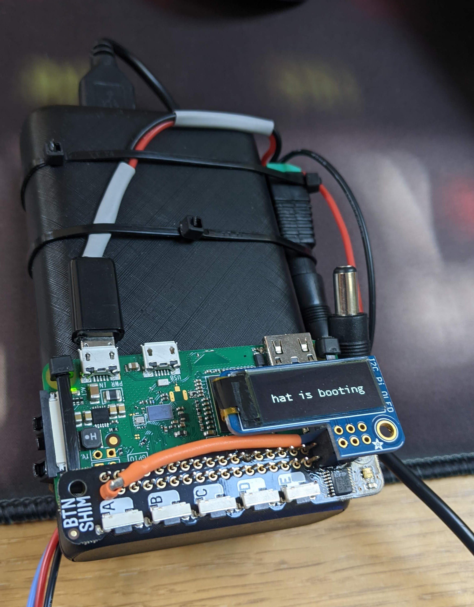

# Hatlights

_I glued 100 WS2812 NeoPixels to a hat then mapped them in 3D space_


## Construction

You will need:

- A [hard hat](https://www.ebay.co.uk/itm/262923531316)
- A [Pi Zero W](https://www.raspberrypi.com/products/raspberry-pi-zero/)
- A [buttom shim](https://thepihut.com/products/button-shim)
- An [OLED display](https://thepihut.com/products/adafruit-pioled-128x32-monochrome-oled-add-on-for-raspberry-pi-ada3527)
- 2 [NeoPixel strings](https://shop.pimoroni.com/products/rgb-led-wire?variant=31607418159187)
- A [power bank](https://www.ebay.co.uk/itm/133977636736)
- Wire
- Hot glue

I hot-glued the lights to the hat, turning in a random(ish) direction after I'd glued-down each one, attempting to move towards empty space each time.

I cable-tied the Pi to the power-bank and wired everything up, producing something you absolutely would not want to try to take through an airport:



The data line is connected to [pin 21](lib/hat.py#L23) ([physical pin 40](https://pinout.xyz/pinout/pin40_gpio21)).

## Installing the software

From a box-fresh install of [Raspberry Pi Bullseye](https://www.raspberrypi.com/news/raspberry-pi-os-debian-bullseye/):

### Set hostname and enable serial port

```bash
sudo raspi-config nonint do_hostname hatlights
sudo raspi-config nonint do_serial 1
sudo raspi-config nonint do_i2c 0
sudo reboot
```

### Install `git`

```bash
sudo apt -y update && sudo apt install -y git
```

### Get this repo

```bash
git clone https://github.com/hat-festival/hatlights
```

### Install everything

```bash
cd hatlights
./configure
make
```

## Mapping the lights

Once everything is assembled, you need to [take lots of photos](camera/README.md), and [do a load of analysis](analysis/README.md).

## Controls

The five buttons are [mapped in `conf/conf.yaml`](conf/conf.yaml#L3-L15):

| button | press to cycle                    | hold to cycle               |
| ------ | --------------------------------- | --------------------------- |
| A      | [modes](#modes)                   |                             |
| B      | colours                           | [colour-sets](#colour-sets) |
| C      | [colour-sources](#colour-sources) |                             |
| D      | [axes](#axes)                     | invert                      |
| E      | [display modes](#display-modes)   |                             |

## Modes

A [`mode`](lib/modes/cuttlefish.py) needs to inherit from [`Mode`](lib/mode.py), and should expose a [`run`](lib/modes/cuttlefish.py#L26) method, which loops forever and does something with the lights, and a [`reconfigure`](lib/modes/cuttlefish.py#L19) method, which resets the hat to the mode's preferences.

The ordering of the modes is [defined in this list](lib/modes_list.py#L8-L15), and the modes' preferences are defined in [conf/conf.yaml](conf/conf.yaml#L58-L117).

Some of the modes involve some pretty intense maths which, if done in real-time, will slow everything down to a crawl. In these cases, it's [sensible to pre-render the set of states](lib/renderers/rotator.py). A `mode` named `foo` will (lazily) attempt to [deserialise a file at `renders/foo.pickle`](lib/mode.py#L67) into an instance attribute called `frame_sets`.

## Colour-sets

Colour sets are defined in [conf/conf.yaml](conf/conf.yaml#L18-L36) - pressing the `colours` button will step through the colours in a set, while holding the same button will step through the sets themselves. It's up to a mode if it actually makes use of these settings.

## Colour sources

There are three kinds of colour-source:

- Redis: this (poorly-named) source means "use whatever colour is currently defined at `hat:colour` in Redis". This is the colour that gets set by the `colour` button
- Wheel: the [ColourWheel](lib/colour_wheel.py) is running as a daemon, and populating the `hat:hue` key in Redis with a constantly-rotating value between 0 and 1, using a step-size and interval defined in [conf/conf.yaml](conf/conf.yaml#L121-L123). Calling `get("colour")` on the [`Custodian`](lib/custodian.py) (which is mostly a wrapper around Redis) will, if the `colour-source` is `wheel`, return an [RGB triple based on that `hue` value](lib/tools.py#L7-L9)
- Random: uses a random hue between 0 and 1 to [generate an RGB triple](lib/tools.py#L7-L9)

## Axes

If you're looking at the hat square-on from the front, then

- `x` goes from -1 on the left to +1 on the right
- `y` goes from -1 at the bottom to +1 at the top
- `z` goes from -1 at the back to +1 at the front

For most of the modes, it makes sense for them orient themselves with respect to an axis, and pressing the `axis` button will cycle through `x`, `y` and `z`. Holding this button will invert the direction of movement along or around that axis.

## Display modes

Pressing the `display modes` button cycles through the three modes for the OLED screen:

- Hat settings: shows the hat mode, and if relevant, the axis/inversion state and the colour and colour-set
- Button config: shows the `abbreviation` fields from the button-mappings. They don't quite line up, but it's good enough
- IP address: shows the hat's current IP address
